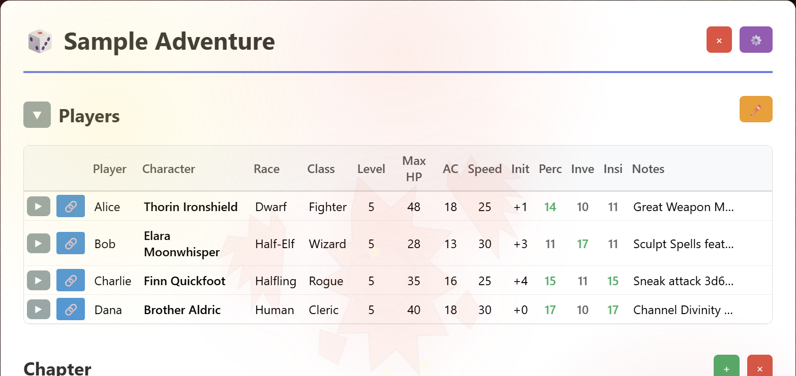
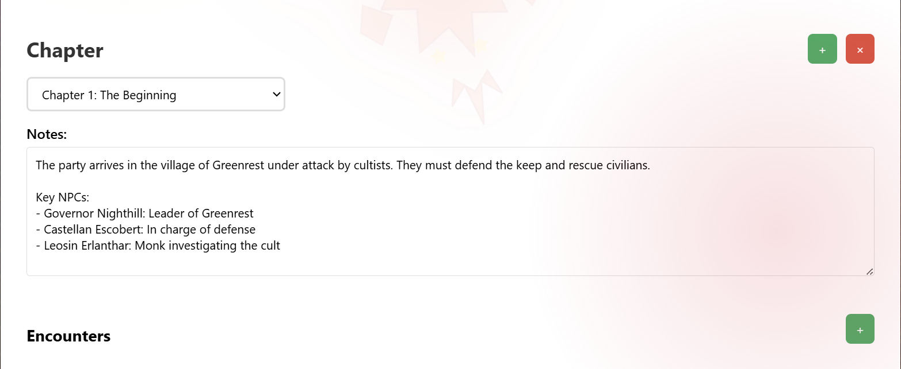
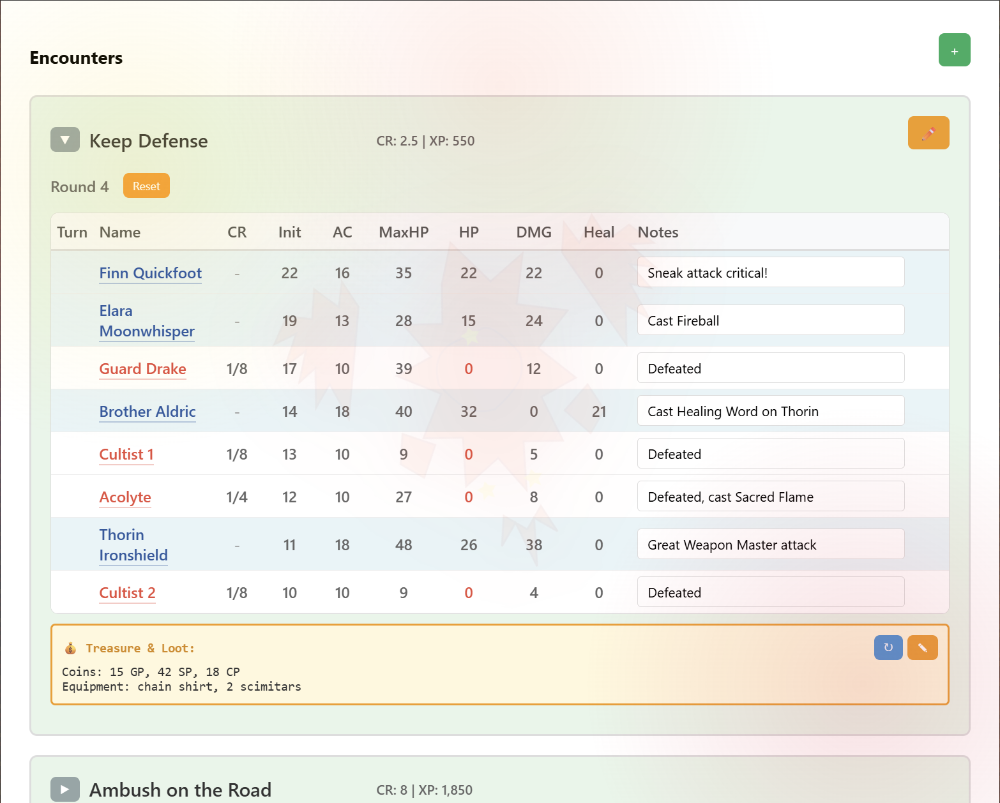

# D&D Encounter Tracker

A web-based Dungeons & Dragons encounter tracker with D&D Beyond integration, featuring automatic stat population, initiative rolling, and an intuitive interface for managing players and combat encounters across multiple chapters.

## Screenshots


*Adventure selection interface with dropdown and new adventure button*


*Player tracking with detailed stats and D&D Beyond integration*


*Active combat encounter with initiative tracking and turn management*

## Features

- 📊 **Intuitive UI** - Clean, modern interface with context-aware controls
- 💾 **Auto-save** - Changes are automatically saved to JSON files
- 📝 **Optimized File Format** - JSON files with intelligent compression:
  - Shortened field names (init/id vs initiative/dndBeyondUrl)
  - Stripped empty values and defaults
  - Character ID extraction (stores just "12345" vs full URL)
  - ~30% file size reduction while maintaining readability
- 🏰 **Multi-Adventure Support** - Create and manage multiple campaigns
- 📖 **Chapter Organization** - Organize encounters by chapters with dedicated notes
- 🎲 **Player Management** - Track detailed player stats including:
  - Player name, character name, race, class, level
  - HP, AC, speed, initiative bonus
  - Passive Perception, Insight, Investigation
  - D&D Beyond character links (with tooltips)
  - Notes field
- ⚔️ **Encounter Tracking** - Manage multiple encounters per chapter with:
  - Three states: unstarted, started, complete
  - Visual state indicators (completed encounters have green background)
  - Automatic player population
  - Turn-by-turn combat tracking
  - Round counter
  - Active turn highlighting
  - HP, Damage, and Healing tracking
  - Damage modal (Ctrl+D) for quick damage assignment
  - Healing modal (Ctrl+H) for healing tracking
  - Edit mode for completed encounters (✏️ button)
  - Context-sensitive controls (edit controls hidden during combat)
  - ESC key closes all modals
- 📊 **Statistics & Charts** - Comprehensive campaign analytics:
  - Initiative Distribution chart (per-player initiative rolls)
  - CR Over Time chart (encounter difficulty progression)
  - Damage Analysis chart with:
    - Stacked bars showing per-player damage contributions
    - Enemy damage dealt to players
    - "Other" category for environmental/untracked damage
- 🔄 **Initiative System** - Automatic initiative rolling with DEX modifiers
- 🐉 **D&D Beyond Integration**:
  - Cookie-based authentication
  - 2,824+ monsters from D&D Beyond
  - Monster tooltips with full stats on hover
  - Just-in-time stat fetching (AC, HP, initiative modifier)
  - Automatic initiative rolling (d20 + modifier)
  - Smart caching with per-monster cache files
- ⭐ **XP Calculator** - Automatic XP calculation based on CR values
- 🎚️ **CR Customization** - Override auto-calculated encounter CR:
  - Edit CR directly in encounter header (edit mode)
  - Visual indicators (orange border = custom, gray = calculated)
  - Non-default values only saved to JSON
  - Useful for partial defeats, story adjustments, environmental factors
  - See [CR_CUSTOMIZATION.md](CR_CUSTOMIZATION.md) for details
- ⌨️ **Keyboard Shortcuts**:
  - Ctrl+D: Open damage tracking modal
  - Ctrl+H: Open healing tracking modal
  - ESC: Close any open modal
- 🔗 **URL Routing** - Direct links to specific adventures and chapters
- 📍 **Scroll Persistence** - Automatically restores scroll position on page refresh
- 🎯 **Smart UI** - Context-aware interface that adapts to workflow:
  - Adventure selection page with dropdown
  - Adventure page with title and management controls
  - Clickable dice icon to return to adventure selection

## Setup

1. **Install Python** (3.8 or higher)

2. **Install dependencies**:
   ```bash
   pip install -r requirements.txt
   ```

3. **Run the application**:
   ```bash
   python app.py
   ```

4. **Open in browser**:
   Navigate to `http://localhost:5000`

5. **⚠️ REQUIRED: Configure D&D Beyond Authentication**
   - The app **requires** D&D Beyond cookies to function
   - On first launch, you'll see a warning and must configure cookies before proceeding
   - See "First-Time Setup" section below for detailed instructions

## Usage

### First-Time Setup: D&D Beyond Integration (REQUIRED)

**⚠️ This step is mandatory** - the app cannot create adventures or fetch monster data without authentication.

1. **Get your cookies** from D&D Beyond:
   - Open [dndbeyond.com](https://www.dndbeyond.com) in your browser
   - **Log in** to your D&D Beyond account
   - Press **F12** to open Developer Tools
   - Go to the **Console** tab
   - Copy and paste this command: `document.cookie`
   - Press **Enter** and copy the entire result (a long string with multiple cookies)

2. **Configure the app**:
   - Click the ⚙️ Settings button (available on all pages)
   - Paste the cookie string into the text area
   - Click "Save Cookies"
   - Once successful, you can create adventures and add monsters

**Note:** The cookie string contains all authentication tokens needed to access D&D Beyond content. Monster details are fetched on-demand when you add them to encounters.

### Creating an Adventure
1. From the home page, click the + button
2. Enter a name for your adventure
3. Start adding players and encounters
4. The adventure title becomes the page header
5. Click the 🎲 dice icon to return to adventure selection

### Managing Players
- Click "+ " button in the Players section to add a new player
- Fill in player details:
  - Player name (real person's name)
  - Character name, race, class, level
  - Max HP, AC, Speed
  - Initiative bonus, Passive Perception/Insight/Investigation
  - Optional: D&D Beyond character URL (hover for tooltip)
  - Notes field for any additional info
- Click × to remove a player
- Changes are automatically saved

### Managing Chapters
- Click "+ " to create a new chapter
- Select a chapter from the dropdown to switch
- Add notes to each chapter using the Notes textarea
- Click × to delete the current chapter
- Encounters are organized by chapter

### Managing Encounters

**Creating Encounters:**
- Click "+ " in the Encounters section to create a new encounter
- Encounters auto-populate with current players
- Click + button to add monsters from the library (2,824+ monsters)
- Hover over monster names to see full stat blocks
- Stats (AC, HP, initiative) are fetched automatically from D&D Beyond

**Running Combat:**
1. **Before Starting** (unstarted state): 
   - All stats (Init, AC, Max HP) are editable
   - +, ↻, and × buttons visible for editing
2. **Click "Start"**: 
   - Encounter begins
   - Combatants sorted by initiative
   - Stats lock (except HP, DMG, Heal, and Notes)
   - Round counter starts at 1
   - Edit controls (+, ↻, ×) hidden
3. **During Combat**:
   - Active combatant highlighted with ▶ arrow
   - Click "Next Turn" to advance
   - Track HP changes (red name when HP ≤ 0)
   - Track damage dealt (DMG column)
   - Track healing (Heal column)
   - Add notes/conditions
   - Use Ctrl+D for quick damage assignment
   - Use Ctrl+H for quick healing
4. **Click "End"**: 
   - Marks encounter complete
   - Encounter card background turns light green
   - Round counter preserved
   - Shows ✏️ Edit button when maximized
5. **Edit Completed Encounters**:
   - Click ✏️ (Edit) button on completed encounters
   - Enables editing of HP, DMG, and Heal columns
   - Click 💾 (Save) to finalize changes
6. **Click "Reset"**: 
   - Returns to unstarted state
   - Re-enables all editing controls

**Other Features:**
- Minimize/expand encounters with ▶/▼ button
- XP automatically calculated and displayed
- Monster names link to D&D Beyond pages (hover for tooltip)

## File Format

Adventures are stored in the `adventures/` directory as JSON files. The format is optimized for storage efficiency while remaining human-readable.

**Optimizations:**
- Field names shortened: `init` instead of `initiative`, `id` instead of `dndBeyondUrl`
- Empty values, zeros, and defaults are stripped
- Character IDs stored as numbers only (e.g., "159764903" instead of full URL)
- Player combatants identified by absence of `name` field
- Monster details looked up from D&D Beyond cache
- ~30% file size reduction compared to verbose format

**Simplified Structure:**
```json
{
  "name": "My Adventure",
  "chapters": ["Chapter 1", "Chapter 2"],
  "chapterNotes": {
    "Chapter 1": "Notes about this chapter..."
  },
  "players": [
    {
      "playerName": "John",
      "name": "Thorin Ironshield",
      "race": "Dwarf",
      "class": "Fighter",
      "level": 5,
      "maxHp": 48,
      "ac": 18,
      "dndBeyondUrl": "159764903"
    }
  ],
  "encounters": [
    {
      "name": "Boss Fight",
      "chapter": "Chapter 1",
      "state": "complete",
      "currentRound": 3,
      "combatants": [
        {
          "init": 15,
          "hp": 32,
          "maxHp": 48,
          "dmg": 12,
          "heal": 5,
          "id": "159764903",
          "ac": 18
        },
        {
          "name": "Cultist",
          "init": 12,
          "maxHp": 9,
          "dmg": 3
        }
      ]
    }
  ]
}
```

**Key Points:**
- Combatants with `id` but no `name` are players (looked up from players array)
- Combatants with `name` are monsters/NPCs (details from D&D Beyond cache)
- Fields with default values (0, empty string, etc.) are omitted
- App automatically restores full field names and URLs when loading

## Tips

- **D&D Beyond Cookies**: Cookies expire periodically. If monster fetching stops working, re-export and import fresh cookies
- **Keyboard Shortcuts**: 
  - Ctrl+D for damage tracking (quick damage assignment between combatants)
  - Ctrl+H for healing tracking (track healing done)
  - ESC to close any modal
- **Statistics Charts**: View campaign analytics on the main page showing initiative distributions, CR progression, and damage analysis
- **Damage Tracking**: The damage chart shows per-player contributions with an "Other" bar for environmental/untracked damage when totals don't match
- **Edit Completed Encounters**: Use the ✏️ button on completed encounters to adjust HP/DMG/Heal values after the fact
- **Initiative Rolling**: Initiative is automatically rolled (d20 + modifier) when monsters are added. Edit before starting the encounter
- **Encounter States**: 
  - Unstarted: Full editing capability, setup mode
  - Started: Combat in progress, limited editing (HP, DMG, Heal, Notes)
  - Complete: Finished encounter, shown with green background, editable via ✏️ button
- **Chapter Organization**: Use chapters to organize encounters by story progression
- **Chapter Notes**: Add session notes, NPC information, or plot points to each chapter
- **XP Tracking**: Total XP is automatically calculated from monster CR values
- **Visual Indicators**: 
  - ▶ arrow shows active turn
  - Red name indicates HP ≤ 0
  - Light green background for completed encounters
- **Monster Tooltips**: Hover over any monster name to see full stat block
- **Minimize Encounters**: Keep your interface clean by minimizing encounters you're not actively using
- **Scroll Position**: Page automatically remembers scroll position on refresh
- **Manual File Editing**: JSON files can be edited directly for bulk changes (field names will be shortened on next save)
- **Backup**: The JSON files are your data - back them up regularly!

## Project Structure

```
dnd-enc/
├── app.py                      # Flask backend with D&D Beyond integration
├── requirements.txt            # Python dependencies (Flask, requests, BeautifulSoup4)
├── start.ps1                   # PowerShell startup script
├── templates/
│   └── index.html             # Main HTML template
├── static/
│   ├── style.css              # Styling with toast notifications
│   ├── script.js              # Frontend JavaScript (~3500 lines)
│   └── chart.umd.min.js       # Chart.js library (local)
├── adventures/                 # JSON data files (auto-created)
│   └── Sample Adventure.json  # Example adventure (included)
└── .cache/                     # Cache directory (auto-created, gitignored)
    ├── cookies.json           # D&D Beyond authentication
    ├── monsters.json          # Monster library index
    └── monsters/              # Individual monster cache files
        └── {id}-{name}.json   # Per-monster cache with timestamp
```

## Technical Details

- **Backend**: Flask 3.0.0 with BeautifulSoup4 for web scraping
- **Frontend**: Vanilla JavaScript (no frameworks) with Chart.js for analytics
- **Data Storage**: Optimized JSON files with intelligent compression
- **Caching**: Per-monster cache files with individual timestamps
- **Authentication**: Cookie-based D&D Beyond session persistence
- **Monster Library**: 2,824 monsters from D&D Beyond
- **Dynamic Lookups**: Monster and player details fetched on-demand to reduce file size
- **URL Routing**: Adventure and chapter state preserved in URL parameters
- **State Management**: Three encounter states (unstarted, started, complete) with appropriate UI controls
- **Charts**: Initiative distribution, CR progression, and damage analysis with per-player breakdowns

## Sample Adventure

The included "Sample Adventure" demonstrates:
- Multiple chapters with notes
- Four diverse player characters with placeholder character IDs
- Encounters in different states:
  - Complete encounters with damage/healing tracking (finished combat with green background)
  - Started encounter (active combat with turn tracking)
  - Unstarted encounters (ready to begin)
- Proper use of DMG and Heal columns
- Damage tracking showing realistic combat scenarios
- Statistics charts with real data
- Chapter organization and navigation

Load it to see the full feature set in action!

